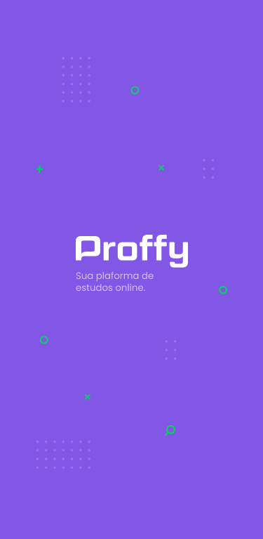

<p align="center">
   
</p>

<div align="center">
  <sub>The NextLevelWeek #2 project. Built with ❤︎ by
    <a href="https://github.com/KaikySantos">Kaiky Santos</a>
  </sub>
</div>

# :pushpin: Table of contents

* [Screenshot](#screenshot) 
* [Technologies](#technologies)
* [How to Run](#run)

<a id="screenshot"></a>

# :camera: Screenshots

### Web Screenshot
<div>
   
   
</div>

### Mobile Screenshot
<div>
   
   
   
   
</div>   

<a id="technologies"></a>

# :computer: Technologies
This project was made using the follow technologies:

* [Typescript](https://www.typescriptlang.org/)      
* [React](https://reactjs.org/)      
* [Expo](https://expo.io/)       
* [Express](https://expressjs.com/)      

<a id="run"></a>

# :construction_worker: How to run
```bash
# Clone the Repository
$ git clone https://github.com/KaikySantos/Proffy.git
# Go to folder
$ cd proffy
```
### 📦 Run API

```bash
# Go to server folder
$ cd server

# Install Dependencies
$ yarn install

# Run Aplication
$ yarn start
```
Access at http://localhost:3333/

### 💻 Run Web Project

```bash
# Go to web folder
$ cd Proffy/web

# Install Dependencies
$ yarn install

# Run Aplication
$ yarn start
```
Go to http://localhost:3000/ to see the result.

### 📱 Run Mobile Project
To run the project you need app [expo](https://play.google.com/store/apps/details?id=host.exp.exponent) instaled or a emulator android/ios.
<br />

```bash
# Go to mobile folder
$ cd Proffy/mobile

# Install Dependencies
$ yarn install

# Run Aplication
$ yarn start
```
Aferter read the QR Code with the app of [expo](https://play.google.com/store/apps/details?id=host.exp.exponent).